<!-- ── ANIMATED NEURAL BANNER ── -->

 

<!-- ── LIVE PORTFOLIO BUTTON & SOCIAL BADGES ── -->

  
  
  
  

---

### 🌌 About Me

I am a final-year **Computer Science Engineering undergraduate**, **Machine Learning Engineer**, and **Software Developer** specializing in **Generative AI, Agentic workflows, and intelligent systems integration**. I bridge the gap between advanced multi-agent orchestrations (LangChain, LangGraph) and responsive, production-ready full-stack applications.

- 🧠 **Focus Areas:** Agentic AI, Large Language Models (LLMs), Prompt Engineering, and Vision Architecture.
- 🚀 **Current Exploration:** Dynamic context retrieval systems, Zero-Shot ReAct agents, and LLM benchmarking.
- 💬 **Ask Me About:** LangChain integration, Streamlit conversational UIs, or AI mathematical problem solvers.
- 📫 **Reach Me:** [`bhakatparthapratim@gmail.com`](mailto:bhakatparthapratim@gmail.com) | **Status:** 🟢 *Open to full-time AI/ML Engineering roles!*

---

### 🔬 Core Architecture & Tech Stack

| **Category** | **Technologies & Frameworks** |
| :--- | :--- |
| **🤖 GenAI & LLMs** |     |
| **🧠 Deep Learning** |     |
| **💻 Systems & Languages** |     |
| **⚡ Full-Stack & UI** |    |
| **🛠️ Tools & DevOps** |    |

---

### ⚡ Featured Deep-Tech Systems

*(Interactive: Click the arrows below to expand the engineering details for each project)*

| Project | Architecture & Tech Stack | Description |
| :--- | :--- | :--- |
| **🤖 [Nexus Autonomous Agents](https://deep-agent-ppb.streamlit.app)** | `Python` · `LangChain` · `LangGraph` · `OpenAI` | **Multi-Agent AI Assistant.** 

<i>View engineering capabilities...</i>
<ul><li>Developed using LangChain and DeepAgents framework featuring a Manager-Worker architecture.</li><li>Engineered persistent cross-thread memory using LangGraph checkpointers and dynamic context retrieval.</li><li>Integrated live web search via Tavily API and enforced structured JSON outputs using Pydantic schemas.</li></ul>
 |
| **🧮 [MathsGPT](https://math-chatbot-ppb.streamlit.app)** | `Python` · `LangChain` · `Streamlit` · `Groq` | **AI Math Problem Solver.** 

<i>View engineering capabilities...</i>
<ul><li>Utilizes a LangChain Zero-Shot ReAct Agent to orchestrate Wikipedia search and reasoning tools.</li><li>Engineered a problem-solving pipeline integrating LLMMathChain via Groq API for step-by-step logic.</li><li>Built a highly responsive conversational UI using Streamlit for real-time mathematical inference.</li></ul>
 |
| **🏆 [KUMBH-CORTEX](https://github.com/parthabhakatppb/KUMBH-CORTEX)** | `PyTorch` · `ResNet-50` · `FastAPI` | **2nd Place Hackathon Winner.** 

<i>View engineering capabilities...</i>
<ul><li>AI-powered public health diagnostics platform for Mahakumbh MP 2028 Preparedness.</li><li>Utilized customized convolutional neural networks achieving highly accurate diagnostic flows.</li></ul>
 |
| **👁️ [CodeAlpha_VisionTrack_AI](https://github.com/parthabhakatppb/CodeAlpha_VisionTrack_AI)** | `YOLOv8` · `DeepSORT` · `TensorRT` | **Real-Time Vision Platform.** 

<i>View engineering capabilities...</i>
<ul><li>High-speed multi-object tracking pipeline optimized for real-time video feeds.</li><li>Designed for robust deployment across edge surveillance environments.</li></ul>
 |

---
